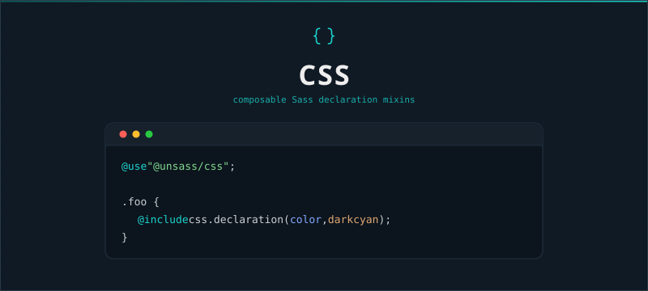

# CSS

[](https://www.npmjs.com/package/@unsass/css)
[](https://www.npmjs.com/package/@unsass/css)
[](https://www.npmjs.com/package/@unsass/css)

## Introduction

CSS is a lightweight Sass toolkit that provides composable mixins for authoring and managing CSS property declarations.
Use it to emit direct declarations or map values to CSS custom-properties so style tokens are consistent and
configurable across a project.

<div align="center">



</div>

## Installing

```shell
npm install @unsass/css
```

## Usage

```scss
@use "@unsass/css";

.foo {
    @include css.declaration(color, darkcyan);
}
```

## Mixins

### `declaration($property, $value, $important)`

Sets a CSS declaration, with optional `!important`. Accepts a custom-property record (see `custom-properties.create()`
below) as either the property or the value to read or write a CSS custom property.

```scss
@use "@unsass/css";

.foo {
    @include css.declaration(color, darkcyan); // Standard declaration.
    @include css.declaration(font-size, 16px, true); // Declaration with `!important`.
    @include css.declaration(box-shadow, (0 0 10px 5px rgba(darkcyan, 0.75), inset 0 0 10px 5px rgba(darkcyan, 0.75))); // Comma-separated values list.
}
```

```css
.foo {
    color: darkcyan;
    font-size: 16px !important;
    box-shadow: 0 0 10px 5px rgba(darkcyan, 0.75), inset 0 0 10px 5px rgba(darkcyan, 0.75);
}
```

#### With a custom property

```scss
@use "@unsass/css";
@use "@unsass/css/custom-properties";

.foo {
    @include css.declaration(custom-properties.create(--foo, darkcyan));
    @include css.declaration(color, custom-properties.create(--foo, darkcyan));
    @include css.declaration(color, custom-properties.create(--foo, custom-properties.create(--bar, darkcyan)));
}
```

```css
.foo {
    --foo: darkcyan;
    color: var(--foo, darkcyan);
    color: var(--foo, var(--bar, darkcyan));
}
```

### `selector($key, $separator, $suffix, $selector)`

Builds a suffixed class selector from a key, useful for generating responsive class variants (e.g. `lg:foo` or
`foo:lg`) without repeating the base selector.

```scss
@use "@unsass/css";

.foo {
    @include css.selector(md) {
        background: darkcyan;
    }
}
```

```css
.md:foo {
    background: darkcyan;
}
```

```scss
@use "@unsass/css";

.foo {
    @include css.selector(md, $suffix: true) {
        background: darkcyan;
    }
}
```

```css
.foo:md {
    background: darkcyan;
}
```

## Custom properties

Import `@unsass/css/custom-properties` to build custom-property records consumed by `css.declaration()`.

### `create($name, $fallback)`

Builds a custom-property record from a name and an optional fallback, ready to be resolved with `create-var()`.

```scss
@use "@unsass/css/custom-properties";

$prop: custom-properties.create(--foo, darkcyan);
// (varname: --foo, fallback: darkcyan)
```

### `get-varname($custom-prop)`

Returns the variable name of a custom-property record.

```scss
@use "@unsass/css/custom-properties";

$name: custom-properties.get-varname(custom-properties.create(--foo)); // "--foo"
```

### `get-fallback($custom-prop)`

Returns the fallback of a custom-property record.

```scss
@use "@unsass/css/custom-properties";

$fallback: custom-properties.get-fallback(custom-properties.create(--foo, darkcyan)); // darkcyan
```

### `is-custom-prop($value)`

Returns whether a value is a custom-property record built by `create()`.

```scss
@use "@unsass/css/custom-properties";

$is-prop: custom-properties.is-custom-prop(custom-properties.create(--foo)); // true
$is-prop: custom-properties.is-custom-prop(darkcyan); // false
```

### `create-var($custom-prop)`

Resolves a custom-property record into a `var()` expression, chaining nested fallback custom-properties.

```scss
@use "@unsass/css/custom-properties";

$var: custom-properties.create-var(custom-properties.create(--foo, darkcyan)); // var(--foo, darkcyan)
```
